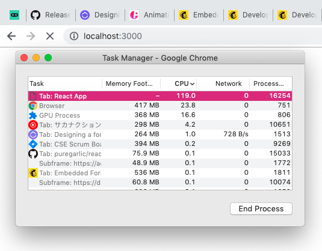
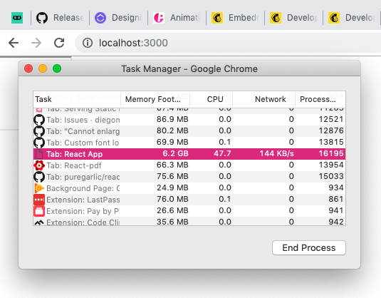

# `@react-pdf/renderer` font issue

Applying a custom font during browser-side rendering causes the tab to use a ridiculous amount of resources endlessly.

To run this repro, all you need to do is install the dependencies (`yarn` or `npm i`) and then run `npm start` or `yarn start`, which will open `http://localhost:3000` in your default browser. The page should fail to load, and hang endlessly — to make the example work, remove the `style` prop on line 14 of `src/App.js`.

I recommend opening your browser's task manager and watching the tab's resource usage; this issue appears to be browser independent. A couple screenshots from Chrome on my machine:

